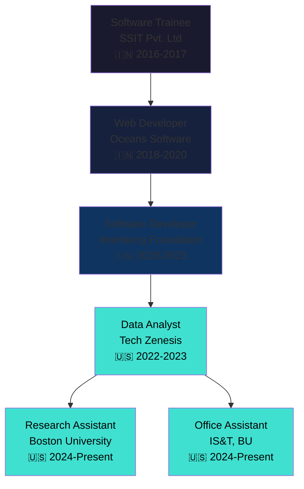

# 🌟 Welcome to Pooja Sukhdeve's Digital Universe 🌟

<div align="center">
  


[](https://linkedin.com/in/poojasukhdeve)
[](https://github.com/poojasukhdeve)
[](mailto:poojasukhdeve06@gmail.com)
[](#)

</div>

---

## 🚀 About Me

```python
class PoojaSuccdeve:
    def __init__(self):
        self.name = "Pooja Sukhdeve"
        self.role = "Data Scientist & Full-Stack Developer"
        self.location = "Boston, MA"
        self.education = "MS Computer Science @ Boston University"
        self.experience = "5+ years"
        
    def current_work(self):
        return [
            "🔬 Research Assistant @ Boston University",
            "💻 Developing accessibility tools for visually impaired users",
            "🏆 1st Place Winner - BU Hackathon 2024",
            "📚 Contributing to inclusive Python learning materials"
        ]
    
    def skills(self):
        return {
            "languages": ["Python", "R", "SQL", "JavaScript", "TypeScript"],
            "ml_frameworks": ["Scikit-learn", "SHAP", "Pandas", "NumPy"],
            "web_technologies": ["React", "Node.js", "Angular", "HTML5", "CSS"],
            "data_visualization": ["Tableau", "PowerBI", "Matplotlib", "Seaborn"],
            "cloud_tools": ["AWS", "Apache Spark", "Git"]
        }
```

---

## 🛠️ Tech Arsenal

### 💻 Programming Languages
<p align="center">
  
</p>

### 🔧 Frameworks & Libraries
<p align="center">
  
</p>

### 🗄️ Databases & Cloud
<p align="center">
  
</p>

### 📊 Data Science & ML Tools
<div align="center">


</div>

---

## 📈 GitHub Analytics

<div align="center">
  
[](https://git.io/streak-stats)

</div>

<div align="center">
  


</div>

---

## 🌟 Featured Projects

<div align="center">

### 🪐 Exoplanet Detection with ML
[](https://github.com/poojasukhdeve/exoplanet-analysis)

**Tech Stack:** `Python` `Scikit-learn` `SHAP` `Random Forest` `Gradient Boosting`
- 🎯 Achieved 75% accuracy in exoplanet detection
- 🔍 Used SHAP for model interpretability
- 📊 Enhanced scientific insights through ML

### 🏥 Health Risk Prediction System
[](https://github.com/poojasukhdeve/brfss-health-analytics)

**Tech Stack:** `R` `Machine Learning` `KNN` `Random Forest` `SHAP`
- 🏆 84.3% model accuracy achieved
- 📈 KNN with top TPR (0.7903) and TNR (0.8796)
- 💊 Supporting health insurance optimization

### 📺 Netflix Content Analytics Dashboard
[](https://github.com/poojasukhdeve/netflix-tableau-dashboard)

**Tech Stack:** `Tableau` `Data Visualization` `Analytics`
- 🌍 Global content library analysis
- 📊 Interactive visualizations
- 📈 Growth trends since 2015

</div>

---

## 💼 Professional Journey


```mermaid
graph TD
    A[Software Trainee<br/>SSIT Pvt. Ltd<br/>🇮🇳 2016-2017] --> B[Web Developer<br/>Oceans Software<br/>🇮🇳 2018-2020]
    B --> C[Software Developer<br/>Interbeing Foundation<br/>🇮🇳 2020-2023]
    C --> D[Data Analyst<br/>Tech Zenesis<br/>🇺🇸 2022-2023]
    D --> E[Research Assistant<br/>Boston University<br/>🇺🇸 2024-Present]
    D --> F[Office Assistant<br/>IS&T, BU<br/>🇺🇸 2024-Present]
    
    style A fill:#1a1a2e
    style B fill:#16213e
    style C fill:#0f3460
    style D fill:#40e0d0,color:#000
    style E fill:#40e0d0,color:#000
    style F fill:#40e0d0,color:#000
```

---

## 🏆 Achievements & Recognition

<div align="center">

| 🏅 Achievement | 📅 Year | 🎯 Details |
|:---:|:---:|:---|
| 🥇 **1st Place BU Hackathon** | 2024 | Data science model with actionable business insights |
| ☁️ **AWS Cloud Foundations** | 2025 | AWS Academy Certification |
| 📚 **Published Author** | 2021 | IGI Global - AR/VR Learning Environments |
| 📖 **Research Publication** | 2021 | Digital Built Environment Transformational Change |

</div>

---

## 🎯 Current Focus

<div align="center">

```diff
+ 🔬 Developing Python visualization modules for visually impaired users
+ 🤖 Advanced machine learning research at Boston University
+ 📊 Creating inclusive data science educational materials
+ 🚀 Contributing to open-source accessibility projects
```

</div>

---

## 📊 Activity Graph

[](https://github.com/ashutosh00710/github-readme-activity-graph)

---

## 🤝 Let's Connect & Collaborate!

<div align="center">

### 💡 Open to collaborate on:
- 🔬 **Machine Learning Research Projects**
- 🌐 **Full-Stack Web Applications**
- 📊 **Data Science & Analytics**
- ♿ **Accessibility-focused Technologies**
- 🚀 **Open Source Contributions**

<br/>

**📧 Reach out:** [poojasukhdeve06@gmail.com](mailto:poojasukhdeve06@gmail.com)  
**📱 Call:** [+1 (617) 963-6004](tel:+16179636004)

</div>

---

<div align="center">
  
### 🌟 "Transforming data into insights, code into solutions, and ideas into reality" 🌟


</div>

---

<div align="center">
  
</div>
